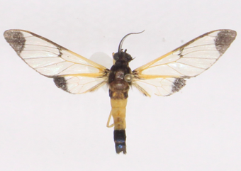
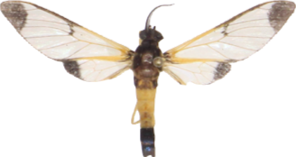

# Static Segmentation by Tracking: A Frustratingly Label-Efficient Approach to Fine-Grained Segmentation
[Imageomics Institute](https://imageomics.osu.edu/)

[Zhenyang Feng](https://defisch.github.io/), [Zihe Wang](https://ziheherzwang.github.io/HerzWangWebsite/), Saul Ibaven Bueno, Tomasz Frelek, Advikaa Ramesh, Jingyan Bai, Lemeng Wang, [Zanming Huang](https://tzmhuang.github.io/), [Jianyang Gu](https://vimar-gu.github.io/), [Jinsu Yoo](https://jinsuyoo.info/), [Tai-Yu Pan](https://tydpan.github.io/), Arpita Chowdhury, Michelle Ramirez, [Elizabeth G Campolongo](https://egrace479.github.io/), [Matthew J Thompson](https://www.linkedin.com/in/thompson-m-j/), [Christopher G. Lawrence](https://eeb.princeton.edu/people/christopher-lawrence), [Sydne Record](https://umaine.edu/wle/faculty-staff-directory/sydne-record/), [Neil Rosser](https://people.miami.edu/profile/74f02be76bd3ae57ed9edfdad0a3f76d), [Anuj Karpatne](https://anujkarpatne.github.io/), [Daniel Rubenstein](https://eeb.princeton.edu/people/daniel-rubenstein), [Hilmar Lapp](https://lappland.io/), [Charles V. Stewart](https://www.cs.rpi.edu/~stewart/), [Tanya Berger-Wolf](https://cse.osu.edu/people/berger-wolf.1), [Yu Su](https://ysu1989.github.io/), [Wei-Lun Chao](https://sites.google.com/view/wei-lun-harry-chao)

[[arXiv]](https://arxiv.org/abs/2501.06749) [[Dataset]](https://github.com/Imageomics/NEON_beetles_masks.git) [[BibTeX]](#-citation)


## 🗓️ TODO
- [x] Release inference code
- [x] Release beetle part segmentation dataset
- [ ] Release online demo
- [x] Release Open-Close Cycle Consistency Loss (OC-CCL) fine-tuning code
- [x] Release trait retrieval code
- [x] Release butterfly trait segmentation dataset

## 🛠️ Installation

Install from PyPI:

```
pip install sstrack
```

or with [uv](https://docs.astral.sh/uv/):

```
uv pip install sstrack
```

For raw camera formats (CR2, NEF, ARW, DNG) in `sst segment-and-crop`, install the optional extra:

```
pip install "sstrack[raw]"
```

SST builds on SAM2 and Grounding DINO through HuggingFace `transformers`. Model weights are downloaded from the HuggingFace Hub the first time a model is used and cached under `~/.cache/huggingface` (override with `HF_HOME`), so there is no manual checkpoint download step. The first run needs network access and will fetch a few hundred MB depending on the chosen model; subsequent runs reuse the cache and work offline. The default SAM2 model is `facebook/sam2.1-hiera-tiny`; pass `--model facebook/sam2.1-hiera-large` (or another variant) for higher quality, and `--device cpu`/`--device cuda` to choose hardware (auto-detected by default).


## 🧑‍💻 Usage

### Specimen Segmentation
Go to the [SAM](https://segment-anything.com/) demo, upload a representative image (e.g., `img001.png`), click the portions to segment, and select "Cut out object" from the sidebar. Right click and save the extraction (`img001_extracted.png`).

See the two examples[^1] below:
`img001.png`            |  `img001_extracted.png`
:-------------------------:|:-------------------------:
  |  

[^1]: Example images are from Santos, S. C. P. (2025). _Wasp-Moth Mimicry_. Hugging Face. <https://huggingface.co/datasets/Sol-Carolina/Wasp_moth_mimicry>.

Then run the following two commands to generate the mask (like a guide for the model in segmentation shape--note the final processed image will _appear_ to be an all black image):

```
sst mask-from-crop \
--image_path img001.png \
--image_crop_path img001_extracted.png \
--mask_image_path_out img001_extracted_processed.png
```

Example output:
`img001_extracted_processed.png`|
:-------------------------:|
  |


```
sst prepare-mask \
--mask_image_path img001_extracted_processed.png \
--mask_image_path_out img001_extracted_processed.png
```

Example output (NOTE: the color is very faint):
`img001_extracted_processed.png`|
:-------------------------:|
  |

Now that the mask has been generated, the following command can be run to segment your remaining images.

```
sst segment-and-crop \
  --support_image img001.png \
  --support_mask img001_extracted_processed.png \
  --query_images [PATH_TO_IMAGE_DIRECTORY] \
  --output [PATH_TO_SEGMENTED_OUTPUT_DIRECTORY]
```

The default mode loads all query images at once. On large datasets, add `--per-image` to walk the folder recursively and process one image at a time (this also supports raw formats and can resume with `--no-reprocess`).

### Trait Segmentation
For one-shot trait/part segmentation, please run the following demo code:
```bash
sst segment --support_image /path/to/sample/image.png \
  --support_mask /path/to/greyscale_mask.png \
  --query_images /path/to/query/images/folder \
  --output /path/to/output/folder \
  --output_format "png" # png or gif, optional
```

### Trait-Based Retrieval
For trait-based retrieval, please refer to the demo code below:
```bash
sst retrieve --support_image /path/to/sample/image.png \
  --support_mask /path/to/greyscale_mask.png \
  --trait_id 1 \
  --query_images /path/to/query/images/folder \
  --output /path/to/output/folder \
  --output_format "png" \
  --top_k 5
```

### Fine-tuning with OC-CCL
OC-CCL (Open-Close Cycle Consistency Loss) fine-tuning is not part of the installable package. Its scripts (`experiments/oc_ccl.py`, ablations, and the curriculum variant) predate the v2.0.0 migration to HuggingFace `transformers` and still depend on the vendored SAM2 copy that shipped with the v1.1.0 scripts-era release. See [`experiments/README.md`](experiments/README.md) for details; porting OC-CCL to the `transformers` backend is tracked as a follow-up.

## 📊 Dataset
Beetle part segmentation dataset is available [here](data/neon_beetles/).

Butterfly trait segmentation dataset can be accessed [here](data/cambridge_butterfly/).

The instructions and appropriate citations for these datasets are provided in the Citation section of their respective READMEs.

## ❤️ Acknowledgements
This project builds on [SAM2](https://github.com/facebookresearch/sam2) and [GroundingDINO](https://github.com/IDEA-Research/GroundingDINO) through their [HuggingFace `transformers`](https://github.com/huggingface/transformers) implementations. We are grateful to the developers and maintainers of these projects for their contributions to the open-source community.
We thank [LoRA](https://github.com/microsoft/LoRA) for their great work.

We also thank [David Carlyn](https://davidcarlyn.wordpress.com/) for his contributions to improving the repository’s ease of setup, workflows, and overall usability; and [Sam Stevens](https://samuelstevens.me/) for developing a nice interactive tool for mask generation, selection, and visualization.


## 📝 Citation
If you find our work helpful for your research, please consider citing using the following BibTeX entry:
```bibtex
@misc{feng2025staticsegmentationtrackingfrustratingly,
      title={Static Segmentation by Tracking: A Frustratingly Label-Efficient Approach to Fine-Grained Segmentation}, 
      author={Zhenyang Feng and Zihe Wang and Saul Ibaven Bueno and Tomasz Frelek and Advikaa Ramesh and Jingyan Bai and Lemeng Wang and Zanming Huang and Jianyang Gu and Jinsu Yoo and Tai-Yu Pan and Arpita Chowdhury and Michelle Ramirez and Elizabeth G. Campolongo and Matthew J. Thompson and Christopher G. Lawrence and Sydne Record and Neil Rosser and Anuj Karpatne and Daniel Rubenstein and Hilmar Lapp and Charles V. Stewart and Tanya Berger-Wolf and Yu Su and Wei-Lun Chao},
      year={2025},
      eprint={2501.06749},
      archivePrefix={arXiv},
      primaryClass={cs.CV},
      url={https://arxiv.org/abs/2501.06749}, 
}
```
