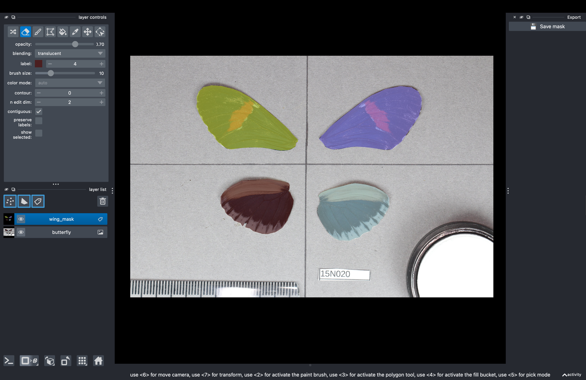

# Generating a Reference Mask with napari

`napari_annotate.py` opens a butterfly specimen image as a napari Labels layer and lets you trace each wing using the polygon tool, assigning integers 1–4 for right forewing, left forewing, right hindwing, and left hindwing. A docked Save button casts the Labels array from `int32` to `uint8` and writes it as a greyscale PNG via `imageio.imwrite`, producing exactly the format SST's `--support_mask` expects.

## Quick Reference

| Item | Value |
|------|-------|
| Package | `napari[all]==0.7.0` |
| Dependencies | `imageio`, `scikit-image`, `magicgui` |
| Output format | Greyscale PNG, uint8, values 0–4 |
| Label convention | 1 = right forewing, 2 = left forewing, 3 = right hindwing, 4 = left hindwing |
| SST argument | `--support_mask` |

## Installation

```bash
pip install "napari[all]==0.7.0" imageio scikit-image magicgui
```

## Script

Save the following as `napari_annotate.py` in your SST directory:

```python
import numpy as np
import imageio.v3 as iio
from skimage import io
import napari
from magicgui.widgets import PushButton

IMAGE_PATH = "your_image.jpg"   # change this
OUTPUT_PATH = "mask.png"        # change this

image = io.imread(IMAGE_PATH)
viewer = napari.Viewer()
viewer.add_image(image, name="butterfly")
labels_layer = viewer.add_labels(
    np.zeros(image.shape[:2], dtype=np.int32),
    name="wings"
)

def save_mask():
    mask = labels_layer.data.astype(np.uint8)
    iio.imwrite(OUTPUT_PATH, mask)
    print(f"Saved mask to {OUTPUT_PATH}")

btn = PushButton(label="Save Mask")
btn.clicked.connect(save_mask)
viewer.window.add_dock_widget(btn, area="right")
napari.run()
```

## Usage

1. Edit `IMAGE_PATH` and `OUTPUT_PATH` at the top of the script
2. Run: `python napari_annotate.py`
3. In the viewer, select the **Labels** layer
4. Choose the **polygon** tool from the toolbar
5. Set the label value to the wing you are tracing:
   - `1` = right forewing
   - `2` = left forewing
   - `3` = right hindwing
   - `4` = left hindwing
6. Trace the full forewing and hindwing outlines for each wing, then click **Save Mask** in the right dock panel

## Worked Example: Heliconius Collection

This example walks through annotating a dorsal specimen image from the [Heliconius Collection (Cambridge Butterfly)](https://huggingface.co/datasets/imageomics/Heliconius-Collection_Cambridge-Butterfly) dataset. First retrieve a sample image using the HuggingFace Hub (see [Getting a sample dataset](index.md#getting-a-sample-dataset)), then run the script pointing at one of the downloaded images.

```bash
python napari_annotate.py
# Edit IMAGE_PATH to e.g. heliconius_sample/00.jpg
# Edit OUTPUT_PATH to e.g. heliconius_sample/00_mask.png
```

When the napari viewer opens:




1. The specimen image appears as the base layer
2. Select label value `1` and trace the complete outline of the right forewing, following the full wing margin from base to tip
3. Select label value `2` and trace the complete outline of the left forewing
4. Select label value `3` and trace the complete outline of the right hindwing
5. Select label value `4` and trace the complete outline of the left hindwing
6. Click **Save Mask** to write the annotation

The output PNG will have pixel values 0–4 corresponding to background and the four wings. This mask is passed directly to SST as a reference frame via `--support_mask`.

## Notes

- The Save button writes a uint8 PNG with values 0–4, directly usable as SST's `--support_mask`
- Within-species propagation (e.g. CAM to CAM) produces clean results; cross-species propagation shows expected degradation consistent with SST's general behaviour
- Trace the full forewing and hindwing outlines rather than individual trait regions for best propagation results
